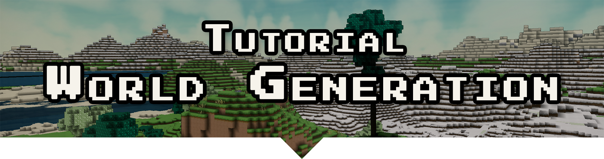

<div align="center">

</div>

# Tutorial: World Generation

_This is a tutorial module for [Terasology].
It explains the concepts of world generation and how to apply them to implement new world generators._

<h2 align="center"><a href="https://terasology.github.io/Health">👉 Tutorial 👈</a></h2>

## Features

### Faceted World Generation

Build up information about the landscape and its features from multiple facets.
Like a cut gem, each facet is one side of a many-sided process.
Facet providers fro a graph allowing for reuse and compositon.
From dense height maps to sparse object configurations - the choice is yours!

### World Rasterizers

The tools to turn abstract ideas into blocks in the world.
Each rasterizer interprets facet data to decide on the type and shape of a block to place.
All rasterizers of a world generation setup work together in shaping the world the player is exploring.

### Modular and Extensible

Terasology's modular design also applies to the world generation framework.
Modules can implement both facet providers and rasterizers to customize the creation process. 
For even more flexibility, world generation allows to plug in extensions to bring unique features such as lakes, caves, or vaolcanoes to the game.

## Contributing

We welcome contributions to our modules, be it bug fixes or feature contributions. 
Check out the [Contributor Guide][contributor-guide] on the main project wiki to learn more.

To check out this module (and all its dependencies) to your Terasology workspace run (in the workspace root):

```
groovyw module recurse TutorialWorldGeneration
```

To build a module JAR for just this module run (in the workspace root):

```
gradlew :module:TutorialWorldGeneration:jar
```

To run all tests and static code checks for this module run (in the workspace root):

```
gradlew :module:TutorialWorldGeneration:check
```

### Documentation via gh-pages

The documentation of this module is build with [docsify]. 
It is served via [gh-pages].
To preview the site you can either use the `docsify` [CLI tool](https://github.com/docsifyjs/docsify-cli) or just run a static server on the `docs` folder.

<!-- References -->
[Terasology]: https://github.com/MovingBlocks/Terasology
[gh-pages]: https://pages.github.com/
[docsify]: https://docsify.js.org/#/
[contributor-guide]: https://github.com/MovingBlocks/Terasology/wiki/Contributor-Quick-Start
